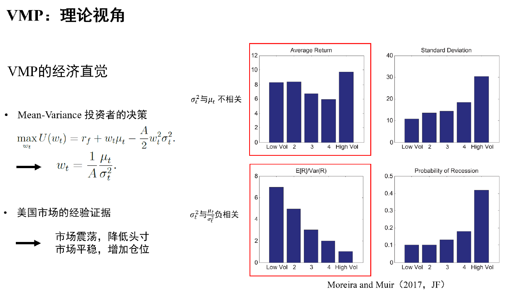
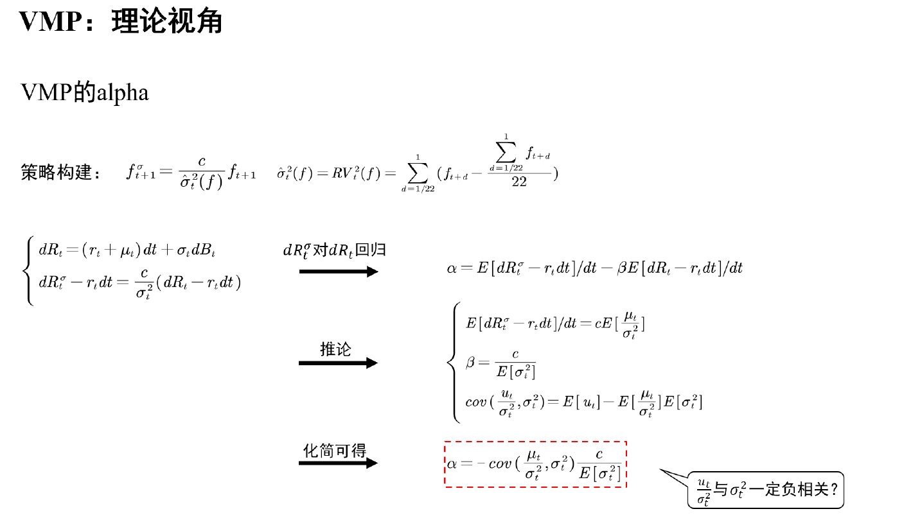
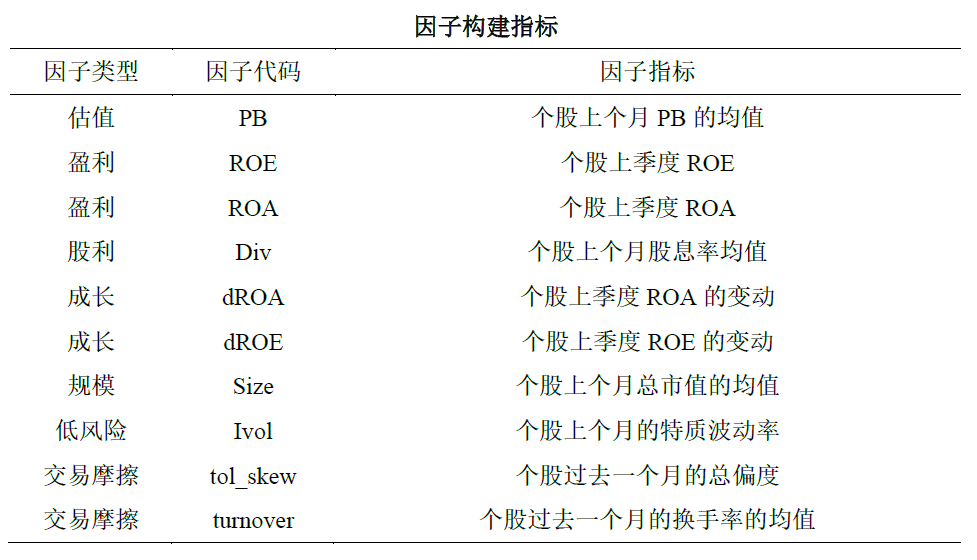
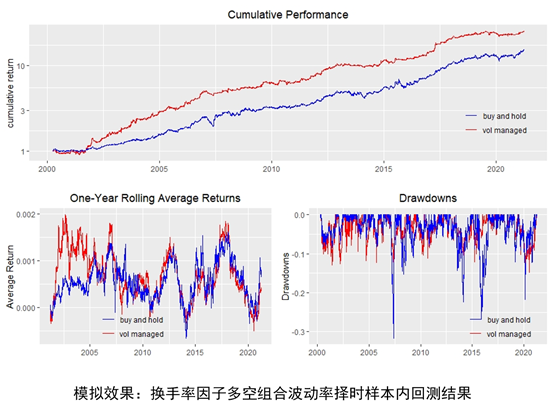
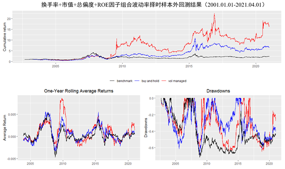

# Volatility-Managed Portfolios

[toc]

## 策略概述

参考Moreira and Muir（2017 JF）构建波动率管理组合（Volatility-Managed Portfolios，VMP），基于2000年到2021年年全A股数据展开实证。

针对Liu et al.（2019）对VMP样本外回测结果的批评，本文测试了VMP的样本外表现，得出不同的结论。

## 策略原理

## 策略构建

构建如下因子池

因子计算窗口为2000年1月1日到2021年4月1日，计算时剔除金融行业公司、次新股以及ST和ST*股，每月（季）初调仓，调仓时对连续型变量进行上下1%缩尾处理。最后，本文主要计算多头组合日度收益率，多空组合结果类似。个股日度行情数据来自**Tushare**和，财务数据来自CSMAR。

## 策略表现

### 样本内

### 样本外

## 代码和数据说明

主要代码为vol-timing.R

主要数据为factor_daily中的因子收益率