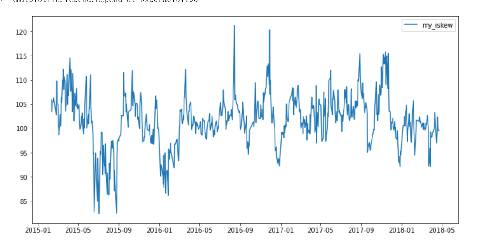

# 计算中国偏度指数ISKEW

## ISKEW计算公式：

## 数据来源

计算ISKEW所用到的SHIBOR和期权价格完全来自**tushare**

### 变量说明：

**关于期权价格**

* 首先筛选出剩余期限大于7天的合于
* 应该根据期权是否成交，基于特定规则从买价和卖价中推算期权价格。由于数据限制直接用tushare提供的期权收盘价作为代替。

**关于公式中的变量（从CBOE skew index白皮书抄来的）**

注1：次近月偏度算法与近月偏度算法一致

注2：当近月合约剩余期限大于30天时，直接用近月偏度计算ISKEW

## 结果分析

用该程序算出来的ISKEW和中信期货某篇研报的计算结果相比在趋势上比较一致，数值上有所差异。

（然鹅和东海证券的结果不太一样）

* 我算的

* 中信期货研报

* 东海证券研报

* 我算的偏度风险溢价

jupyter notebook内还对偏度风险溢价做了一些统计检验，偏度风险溢价显著为正，且与上证50ETF收益率同期回归后发现回归系数显著为正，还是有点东西的。