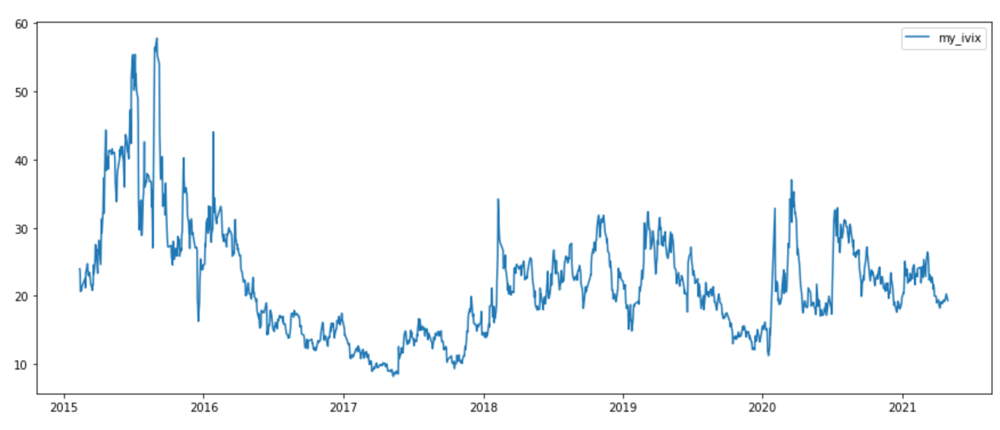
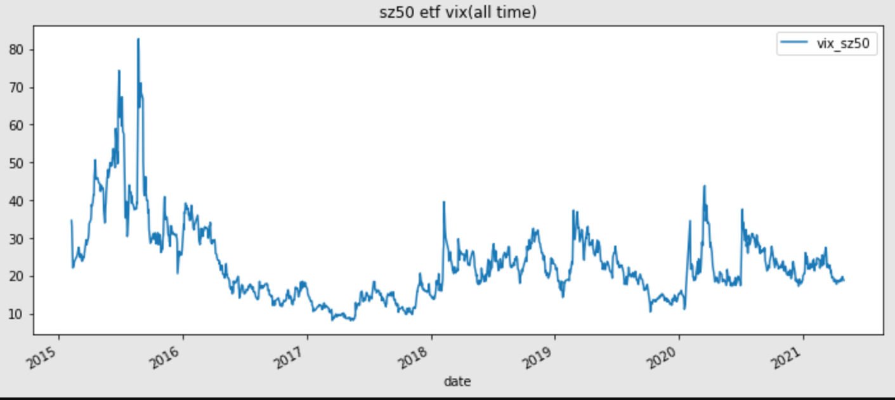

# 计算中国波指IVIX

## IVIX计算公式：

$$
\sigma_{近月}^2 = \frac{2}{T}\Sigma_{i}\frac{\Delta K_i}{K_i}e^{RT}P(K_i) - \frac{1}{T}[\frac{F}{K_0} - 1]^2
$$

$$
IVIX = 100\times \sqrt{\{ T_1 \sigma_1^2[\frac{NT_2 - NT_{30}}{NT_2 - NT_1}] \} + \{ T_2 \sigma_2^2[\frac{NT_{30} - NT_{1}}{NT_2 - NT_1}] \} \times\frac{N_{365}}{N_{30}}}
$$

## 数据来源

计算IVIX所用到的SHIBOR和期权价格完全来自tushare

ivixx.csv是真实的IVIX报价，来自WIND数据库

### 变量说明：

**关于期权价格**

* 首先筛选出剩余期限大于7天的合于
* 应该根据期权是否成交，基于特定规则从买价和卖价中推算期权价格。由于数据限制直接用tushare提供的期权收盘价作为代替。

**关于公式中的变量（从IVIX白皮书抄来的）**

$\sigma_1$：近月波动率

$NT$：近月合约剩余到期时间（以分钟计）（**这里搞不明白所以用年计了。。。。**）

$T$：$\frac{NT}{N_{365}}$

$R$：无风险利率，我用SHIBOR插值

$S$：认购期权价格与认沽期权价格相差最小的行权价

$F$：$S+ e^{RT}\times [行权价为S的认购期权价格 - 行权价为S的认沽期权价格]$

$K_0$：小于F且最接近F的行权价

$K_i$：由小到大的所有行权价（i=1，2，3）

$\Delta K_i$：第i个行权价对应的间隔，一般等于$\frac{K_{i+1} - K_{i-1}}{2}$（**这里不知道i=1和n时咋整，令$\Delta K_1=\frac{K_2 - K_1}{2}$，$\Delta K_n$类似处理**）

$P(K_i)$：如果$K_i<K_0$则等于$K_i$对应的看涨价格；如果$K_i>K_0$则等于$K_i$对应的看跌价格；如果相等就等于看涨看跌中间价

注1：次近月波动率算法与近月波动率算法一致

注2：当特殊行情导致执行价覆盖不充分时，用BS公式填充部分虚拟行权价合约，并带入近月和次近月波动率的计算

注3：当近月合约剩余期限大于30天时，直接用近月波动率乘以100作为IVIX

## 结果分析

用该程序算出来的IVIX和上海纽约大学波动率研究所计算结果在趋势上比较一致，数值上有所差异。

总而言之，用这段代码粗糙计算看看波动率大概走势，或者顺手做点小实证应该没啥大问题。。。

* 我算的

* 上海纽约大学波动率研究所算的

